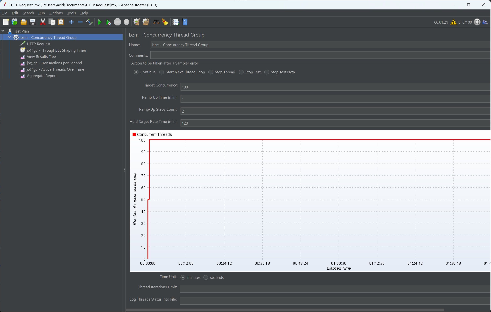
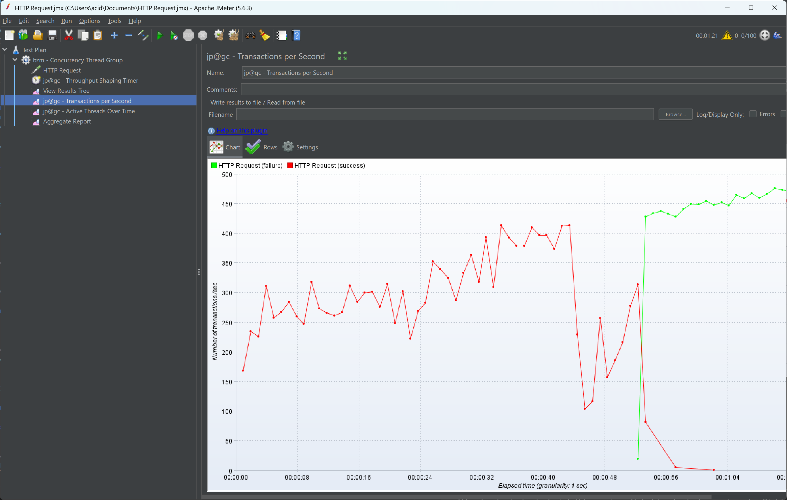
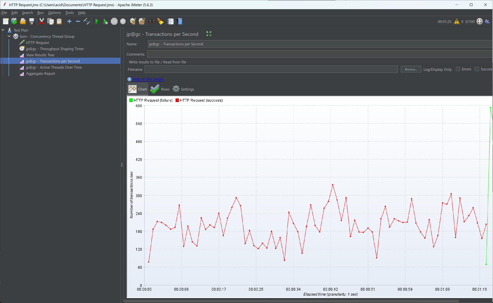

# Запуск проекта
1. Склонировать репозиторий:  
`git clone https://github.com/sertraline/testproj`
2. Перед запуском докер контейнера нужно пробросить локальную директорию в контейнер. Если этого не сделать, данные будут потеряны после остановки контейнера.  
Создадим директорию для данных:  
`mkdir -p fs/volumes/clickhouse-data/`.
3. Теперь нужно дать директории права. Clickhouse использует uid 101.  
`sudo chown -R 101:101 fs/volumes/clickhouse-data/`.
3. Теперь можно поднять контейнер:  
`docker compose up -d`  
Пользователь по умолчанию: `default`  
Пароль по умолчанию: отсутствует.
4. Можно запускать проект: `go run .`

# Структура проекта  
1. controllers - отвечает за обработку эндпоинтов  
2. services - отвечает за бизнес-логику (работа с БД)  
3. validators - отвечает за валидацию запроса и сериализацию данных которые затем попадают в controllers  
4. errors - ошибки используемые в проекте  
5. database - содержит интерфейс для clickhouse  
6. database/models - определяет таблицы в базе данных и как они будут сериализованы в типы  

# Тесты
Для тестирования Clickhouse требует экспортировать env параметры. Для тестирования я использовал уже работающий докер контейнер.  
```bash
export CLICKHOUSE_NATIVE_ENV='{"port": 9000,"host":"localhost"}'
go test -timeout 30s -v github.com/sertraline/testproj/tests
```

# Эндпоинты
## OrderBook

* Создать запись: обменник ig.com с парой USD (159.19, 1000) / JPY (0.0063, 10000).
  ```bash
  curl -X "POST" http://localhost:3333/order_book/ -d \
  '{"exchange_name": "ig", "pair": "USD/JPY", "asks": [{"price": 159.19, "base_qty": 1000}], "bids": [{"price": 0.0063, "base_qty": 10000}]}'
  ```

* Получить запись.  
  Метод ожидает один URL параметр: `pair` (string)  
  Эндпоинт: `GET /order_book/{exchange_name}`   
  ```bash
  curl "http://localhost:3333/order_book/ig?pair=USD/JPY

  {"Id":5,"Exchange":"ig","Pair":"USD/JPY","Asks":[{"price":1.5,"base_qty":1000},{"price":2,"base_qty":200}],"Bids":[{"price":1.5,"base_qty":20000}]}
  ```


## OrderHistory

* Создать запись.  
  Метод ожидает вложенный JSON вида:  
  ```
    { "order": 
      { 
        side,
        type,
        base_qty
        price,
        algorithm_name_placed,
        lowest_sell_prc,
        highest_buy_prc,
        commission_quote_qty,
        time_placed
      },
    "client":
      {
        exchange_name,
        label,
        pair
      } 
    }
  ```
  Эндпоинт: `POST /clients/{client_name}`  
  ```bash
  curl -X "POST" http://localhost:3333/clients/John+Doe -d \
  '{"order": {"side": "LHS", "type": "lever", "base_qty": 5000, "price": 0.0065, "algorithm_name_placed": "statistics", "lowest_sell_prc": 0.0062, "highest_buy_prc":
  0.0063, "commission_quote_qty": 0.0035, "time_placed": "2024-07-13T15:24:11Z"}, "client": {"exchange_name": "ig", "label": "buy", "pair": "USD/JPY"}}'
  ```

* Получить запись.  
  Метод ожидает два URL параметра: `label` и `pair`.  
  Эндпоинт: `GET /clients/{client_name}/{exchange_name}`  
    ```bash
  curl "http://localhost:3333/clients/John+Doe/ig?label=test&pair=USD/JPY

  [{
     "client_name":"John Doe",
     "exchange_name":"ig",
     "Label":"Buy",
     "Pair":"USD/JPY",
     "Side":"LHS",
     "Type":"lever",
     "base_qty":500,
     "Price":0.0063,
     "algorithm_name_placed":"statistics",
     "lowest_sell_prc":0.0062,
     "highest_buy_prc":0.0065,
     "commission_quote_qty":0.0035,
     "time_placed":"2024-07-13T15:01:11Z"
    },
    {
     "client_name":"John Doe",
     "exchange_name":"ig",
     "Label":"Buy",
     "Pair":"USD/JPY",
     "Side":"LHS",
     "Type":"lever",
     "base_qty":500,
     "Price":0.0064,
     "algorithm_name_placed":"auto-hedge",
     "lowest_sell_prc":0.0061,
     "highest_buy_prc":0.0066,
     "commission_quote_qty":0.0035,
     "time_placed":"2024-07-13T16:10:42Z"
    }]
  ```  

# RPS
Для тестирования я использую Apache JMeter. Я запускаю 100 тредов с target RPS = 300. Для тестирования проект запущен на удаленной машине использующей Debian 12.  


## Чтение
Считывание одной и той же записи достигает 400 RPS за 40 секунд, после чего clickhouse перестает отвечать на запросы. Прежде я никогда не использовал Clickhouse и причину я так и не выяснил.  

При попытке переиспользовать уже созданные подключения (не закрывая их), проект перестает отвечать уже при 100 RPS. Если закрывать каждое созданное подключение после SELECT через `conn.Close()`, то RPS может достигать отметки в 400-600.


# Запись
Запросы идут с большими проседаниями, после чего, через минуту, clickhouse так же перестает отвечать на запросы.  


# Время отклика (без кеша)
Для измерений я использую `curl -o /dev/null -s -w 'Total: %{time_total}s\n' `.  
Из man pages:
```
-w, --write-out

All variables are specified as %{variable_name} and to output a normal % you just write them as %%. You can output a newline by using \n, a carriage return with \r and a tab space with \t. The output will be written to standard output, but this can be switched to standard error by using %{stderr}.
```  
Таким образом мы можем использовать переменную time_total для фиксации полного времени обработки запроса.

## OrderBook
### GET  
```bash
curl -o /dev/null -s -w 'Total: %{time_total}s\n' curl "http://localhost:3333/order_book/ig?pair=USD/JPY"

Total: 0.067562s
```  
#### Результат: 68мс

### POST
```bash
curl -o /dev/null -s -w 'Total: %{time_total}s\n' -X "POST" http://localhost:3333/order_book/ -d \
'{"exchange_name": "ig", "pair": "USD/JPY", "asks": [{"price": 159.19, "base_qty": 1000}], "bids": [{"price": 0.0063, "base_qty": 10000}]}'

Total: 0.022867s
```  
#### Результат: 23мс

## OrderHistory
### GET
```bash
curl -o /dev/null -s -w 'Total: %{time_total}s\n' "http://localhost:3333/clients/John+Doe/ig?label=test&pair=USD/JPY"

Total: 0.031746s
```
#### Результат: 32мс  

### POST
```bash
curl -o /dev/null -s -w 'Total: %{time_total}s\n' -X "POST" http://localhost:3333/clients/John+Doe -d \
'{"order": {"side": "LHS", "type": "lever", "base_qty": 5000, "price": 0.0065, "algorithm_name_placed": "statistics", "lowest_sell_prc": 0.0062, "highest_buy_prc":
0.0063, "commission_quote_qty": 0.0035, "time_placed": "2024-07-13T15:24:11Z"}, "client": {"exchange_name": "ig", "label": "buy", "pair": "USD/JPY"}}'

Total: 0.015079s
```
#### Результат: 15мс  

